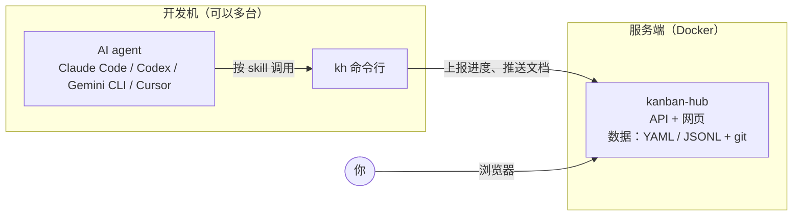

# kanban-hub

> a multi-project kanban for vibe coding


kanban-hub 是一个面向 AI 编程（vibe coding）的自托管多项目进度看板，由 AI 编码助手上报进度。

同时开着好几个项目，让 AI 编码助手在终端里干活，过几天就记不清哪个项目做到哪一步了。进度散在各个仓库的 `TASKS.md` 里，有的在这台电脑上，有的在那台。

有了 kanban-hub，AI 通过命令行工具 `kh` 上报每个项目做到了哪个阶段、哪个任务、卡在哪里；你在一个网页里看全部项目的进度，顺便浏览各仓库里的设计文档和 HTML demo，包括没进 git 的私有文档。

它不是 AI 编码工作区，不负责拉起 agent 执行任务；也不是通用的项目管理系统，没有燃尽图、通知和自动化规则。

## 它怎么工作



- AI 按 skill 里的规则，用 `kh task set`、`kh log` 等命令上报进度。开始一个任务标成进行中，做完标成复核中；需要你决策、验证或者动手的，打上“待你处理”标记。
- `kh` 把仓库里的文档增量推送到服务端。服务端不读任何仓库的磁盘，所以开发机和服务端可以是不同的机器。
- 你打开网页，首页就是所有项目里等你处理的事情。

## 特性

- 首页汇总所有项目里“待你处理”的任务。项目列表显示周期、健康度、当前焦点、进度、停滞天数，以及各台机器上的 git 状态。
- skill 符合 Agent Skills 标准，Claude Code、Codex、Gemini CLI、Cursor 等 agent 都能用。Claude Code 另有 hook：会话开始时注入进度摘要，每轮回复结束后在后台同步文档，改了代码却没上报时提醒一次。
- 开发期按阶段推进，迭代期按特性并行，另有储备和杂项。任务有状态、清单、分组、截止日期和关联文档，网页上可以直接编辑。
- Markdown 在线渲染，支持代码高亮和 mermaid，HTML demo 在沙箱里打开。一台机器上写的私有文档，另一台机器能读取或拉取；两边都改过时自动三方合并，合不了的登记为冲突，交给 AI 处理。
- 在仓库里只写 `.kanban-hub/` 目录，并把它加进 `.git/info/exclude`。不装依赖，不改 `.gitignore` 和 agent 指令文件，不装 git hook。
- 没有数据库。数据是 YAML 和 JSONL 文件，数据目录本身是一个 git 仓库，每次修改都有记录，另外支持 AES-256 加密备份。
- 仓库里已有的进度文档，可以让 AI 整理成 YAML 导入。重复导入不会产生重复条目。

## 快速开始

### 1. 部署服务端

Linux 机器装好 Docker 后：

```bash
curl -fsSL https://raw.githubusercontent.com/LanceLRQ/kanban-hub/main/deploy/kanban-hub.sh | bash
```

向导会问安装目录、端口、管理员密码等，确认后拉取镜像启动。也可以用 Docker Compose 从源码构建：

```bash
git clone https://github.com/LanceLRQ/kanban-hub.git && cd kanban-hub/deploy
cp .env.example .env        # 填写 KH_ADMIN_PASSWORD、PUID、PGID
mkdir -p data backups
docker compose up -d --build
```

### 2. 生成配对码

浏览器打开 `http://<服务器地址>:28970`，登录后进入接入引导页 `/setup`，点“生成配对码”。页面会给出一句话，里面带着这次生成的配对码。配对码每次都不一样，10 分钟内有效，只能用一次。

### 3. 交给 AI

把那句话发给你的 AI 助手：

> 请按 `http://<服务器地址>:28970/setup/agent.md` 的说明把本机接入 kanban-hub，配对码 `<配对码>`。

它会安装 `kh`、登录、安装 skill 与 hook，每一步改动前都会先问你。接着它会问要不要把当前仓库接入，并把仓库里已有的进度导入看板。

开发机需要 Node 22 及以上和 git。

## 文档

用户手册在 [`docs/guide/`](docs/guide/README.md)：

- [部署](docs/guide/01-部署.md)：三种部署方式、环境变量、反向代理
- [接入机器与仓库](docs/guide/02-接入.md)
- [看板的概念](docs/guide/03-看板概念.md)
- [网页使用](docs/guide/04-网页使用.md)
- [kh 命令参考](docs/guide/05-kh命令参考.md)
- [文档同步与冲突](docs/guide/06-文档同步与冲突.md)
- [导入导出](docs/guide/07-导入导出.md)
- [备份与恢复](docs/guide/08-备份与恢复.md)
- [常见问题](docs/guide/09-常见问题.md)

完整的设计规格（数据模型、API、存储格式、同步协议）见 [`docs/superpowers/specs/2026-09-23-kanban-hub-design.md`](docs/superpowers/specs/2026-09-23-kanban-hub-design.md)。

## 版本

当前版本是 0.1.0。

镜像发布在 Docker Hub：`lancelrq/kanban-hub`，有 amd64 和 arm64 两种架构，一键安装脚本默认从这里拉取。

目前只有一个管理员账号，适合个人使用，部署在局域网或 HTTPS 反向代理后面。

## 本地开发

需要 Node 22 及以上、pnpm 11、git。

```bash
pnpm install
pnpm dev             # 开发服务：http://127.0.0.1:28970，数据写在 dev-data/
pnpm test            # 全部测试（Vitest）
pnpm test:deploy     # 部署脚本测试
pnpm typecheck
pnpm lint

pnpm -F @kanban-hub/web build          # 生产构建
pnpm -F @kanban-hub/cli build          # 打包 kh 到 packages/cli/dist/kh.mjs
pnpm -F @kanban-hub/cli run pack:tgz   # 打包 kh 安装包，开发服务的 /setup/kh.tgz 下发它
```

在 Docker 里开发（挂载源码热更新）：

```bash
mkdir -p dev-data/data dev-data/backups
PUID=$(id -u) PGID=$(id -g) docker compose -f docker-compose.dev.yml up --build
```

仓库结构：

```
apps/web/        Next.js（App Router）：API 与网页；src/server/store/ 是唯一读写数据目录的模块
packages/core/   zod schema 与纯逻辑，服务端、kh、网页共用
packages/cli/    kh 命令行，esbuild 打包成单文件
deploy/          生产部署：compose、一键脚本、systemd 示例
docker/          容器入口脚本
docs/            用户手册与设计规格
```

技术栈：Next.js 16、TypeScript、zod、shadcn/ui、Tailwind CSS、next-intl、Vitest、pnpm monorepo。所有功能按测试先行的方式开发。

## 贡献

欢迎提 Issue 讨论需求和设计。提交 PR 前请先开 Issue 沟通。

## License

MIT，详见 [LICENSE](./LICENSE)。
